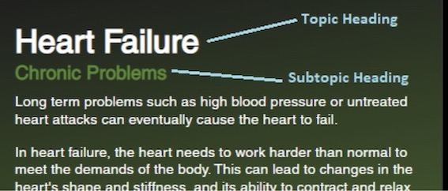
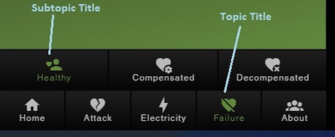

.. include:: ../style.rst

What is the difference between :red:`title` and :red:`heading` of topics/subtopics in topics.json?
======================================================================================================

The :blue:`title` is used as a caption in menu buttons whereas :blue:`heading` are actual headlines that appear at the top of the left panel for each topic/subtopic. (screenshots below)

