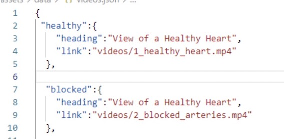

How to understand the path specified for images, videos etc in these data files?
====================================================================================

.. include:: ../style.rst

The specified paths consider the :blue:`static` folder of the application as the root folder. For example, the path shown for the video in the screenshot above assumes that the  :blue:`videos` folder exists in the :blue:`static` folder of the application.