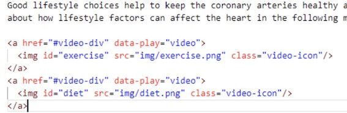

What are the attributes starting with “data-” in html tags in markdown files?
=====================================================================================

.. include:: ../style.rst

These are data attributes that can be defined for html tags in order to store some extra information with the associated html tag. 

The :blue:`data-play=video` added to <a> tag instructs to load the video player at the right hand side panel. Similarly, it is important to add :red:`#video-div` in href attribute of the same <a> tag, as this is helpful to scroll to the appropriate place in small devices, while playing video. The key/name of the video(as defined in videos.json) is specified as the :blue:`id` of  tag of video icon.

