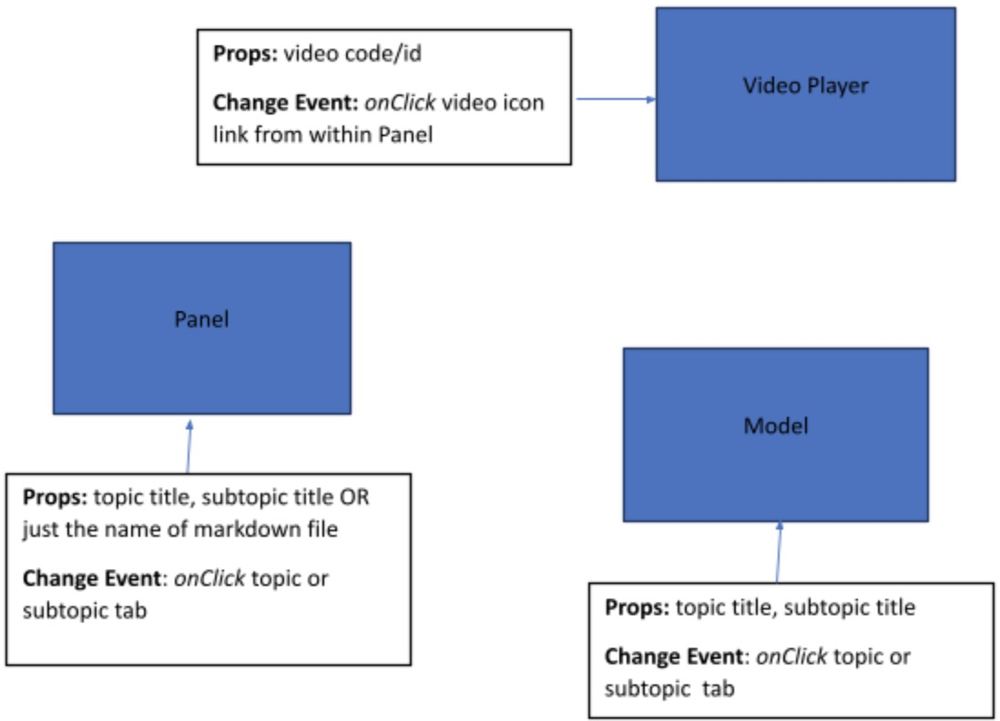

Implementation
====================

.. include:: ../style.rst

Introduction:
--------------
This document provides a brief overview of the new heart vue.js app. The app will be built using Vue3. Basically, it will cover main components and data files of the application. There might be some other small components (to facilitate reusability) that I may not mention here, as this document is primarily aimed to show the way the data will be saved and the flow of information (called as props in vue.js) among main components. 

**Terminologies:**  Main tabs like (Attack, Electricity etc) are referred to as “topics”.  The sub tabs like (Healthy, Minor, Severe etc) are referred as “Subtopics”.

**Data Files:** The data will be saved in the following files:

- :red:`Topics.json`, containing information related to topics and their subtopics

    .. code-block:: bash
        :linenos:

        "failure":{
            "title":"Failure",
            "heading":"Heart Failure",
            "icon":"mdi-heart-off",
            "subTopics":{
                "healthy":{
                    "title":"Healthy",
                    "heading":"Chronic Problems",     
                    "icon":"mdi-account-heart",
                    "dataFile":"failure-healthy",
                    "category":"success",
                    "model":{"name":"NoInfarct"}
                },
                "compensated":{
                    "title":"Compensated",
                    "heading":"Compensated",
                    "icon":"mdi-heart-cog",
                    "dataFile":"failure-compensated",
                    "category":"warning",
                    "model":{"name":"NoInfarct"}
                },
                "decompensated":{
                    "title":"Decompensated",
                    "heading":"Decompensated",
                    "icon":"mdi-heart-remove",
                    "dataFile":"failure-decompensated",
                    "category":"error",
                    "model":{"name":"NoInfarct"}
                }
            }
        }

    
    - The topic name and the subTopic name will consist of a route, under this case here, there would be three routes: :red:`failure-healthy`, :red:`failure-compensated`, :red:`failure-decompensated`.
    - heading: the heading for this topic and will display on frontend left panel.
    - icon: the nav bar icon, you can find more on :red:`https://pictogrammers.com/library/mdi/`
    - dataFile: the markdown filename related to this topic, it will be used in :red:`./frontend/components/topics/Panel.vue` line 63.
    - category: the color for this topic. You can define your own color on :red:`nuxt.config.js` file Vuetify config line 115.
    - model: model name.
    - You also can customise the key:value for yourself, but after this you need to setup it under :red:`./frontend/plugins/current-content.js`, then you can use it in vue files via :red:`this.$key()`, e.g. :red:`this.$category()`.

- To store information for each subtopic, we can have multiple options. The two proposed ways include
    - :blue:`Panels.xml:` contents of each subtopic will be saved via xml tags. The application will read these tags and display contents accordingly. The format in which various elements are displayed will be controlled by code so, full potential of CSS styling can be used to design or to make things responsive. This means less control exercised by users, if they want to change things like design or want to add a new type of element that is not defined in existing xml etc. But still, it can be extended easily by a developer.

    .. code-block:: bash
        :linenos:
        
        <?xml version="1.0" encoding="UTF-8"?>
        <panels>
            <heart-main>
                <section type="text">
                    The heart pumps blood to itself through blood vessels
                    called the conronary arteries.
                </section>
                <inline>
                    <section type="image" name="conronary.png">
                    <section type="video" code="blocked">
                </inline>
                <section type="text">
                    Good lifestyle choices help to keep the conronary arteries
                    healthy and prevent heart attacks.
                </section>
                <inline>
                    <section type="video" code="exercise">
                    <section type="video" code="diet">
                    <section type="video" code="smoking">
                </inline>
            </heart-main>
        </panels>

    - :blue:`Markdown file:` Saving contents of each subtopic in an individual markdown file. The application will read the contents from the file and display in the allocated slot. This way, the user can have complete control of content. But the application may not be able to utilize the full potential of CSS in displaying contents.

    .. code-block::

        This is an interactive model of the heart's two main pumping chambers:
        the ventricles. Spin, zoom, drag, and open the heart using the gestures
        shown at the bottom. Vary the heart rate using the slider on the right. 

         
        

        ---

        The heart pumps blood around the body to provide all the organ systems
        with oxygen and nutrients.

        The ECG trace (top right) represents the electrical waves in the heart
        that stimulate contraction and generate pressure (middle right) to pump
        blood.
        - - -
        Click through the tabs below to learn about various heart diseases.

- :red:`Videos.json`, containing information relevant to each video

    .. code-block:: bash
        :linenos:

        {
            "healthy":{
                "heading":"View of a Healthy Heart", 
                "link":"videos/1_healthy_heart.mp4"    
            },

            "blocked":{
                "heading":"View of a Healthy Heart", 
                "link":"videos/2_blocked_arteries.mp4"
            },
            
            "exercise":{
                "heading":"Lifestyle Factors: Exercise",
                "link":"videos/5_exercise_v2.mp4"
            },

            "diet":{
                "heading":"Lifestyle Factors: Diet",
                "link":"videos/6_diet_v2.mp4"
            },

            "smoking":{
                "heading":"Lifestyle Factors: Smoking",
                "link":"videos/7_smoking_v2.mp4"
            },

            "statin":{
                "heading":"How your static medication will help?",
                "link":"videos/3_Statins.mp4"
            },

            "aspirin":{
                "heading":"How your aspirin medication will help?",
                "link":"videos/4_aspirin.mp4"
            }
        }
- There might be other data files for team/people as in “about” information (needs further discussion)

The main app will be split into left and right pane (as it is currently) 
--------------------------------------------------------------------------

The **left pane** includes:

-  Main Heading

-  Subheading

-  Panel (component), displaying contents of clicked subtopic from
   (either markdown or xml, as discussed above in data section)

-  Menu (the tabs and subtabs populated based on topics.json)

The **Right pane** will switch between two components i.e. :red:`Video Player` and :red:`Model`.

Check the diagram below to understand the change events of these components.

:red:`Note:` Since the work on the Model component will be done at the end when the rest of the app is completed, the props for it may not be final. Right now, when I refer to the Model component, it includes everything i.e. the heart model, the ECG, pressure and heart rate modifier.

