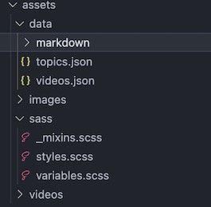

Assets
===========

.. include:: ../style.rst
:green:`ASSETS`

-  assets/data stores information related to various topics

   -  topics.json is the main file which contains list of all topics,
      subtopics and related metadata
   -  markdown folder contains individual files, containing the
      descriptive text of each tab clicked through menu
   -  videos.json provide the name and path information of the videos

-  assets/sass manages styles for the website and includes:

   -  variables.scss - sass variables used throughout, also includes
      Vuetify sass variables
   -  base.scss - global styles applied directly to html tags
   -  global.scss - global styles that are used at multiple places
      throughout the website

Components and pages folders contain the styles specific to particular component/page specified in the file name. For most pages/components styles specific to them are defined in the actual page/component implementation file.  However, a small number, where the list of styles became long, is maintained here in these .scss files. Take a note of whether these styles are included with the “scoped” attribute or not, in their relevant page/component. If a scoped attribute is not used, then styles are being used in the child components as well.
