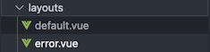

Layout
===========

.. include:: ../style.rst

:green:`Layout`

-  default.vue is the default layout and error.vue is actually the error
   page.
-  empty.vue is the additional layout, which contains a blank template,
   and is used as layout for the error page. In case, this layout is not
   specified for the error page, the error page will be shown with
   default layout. This might produce some undesirable results, as we
   dont want to show the left panel(which is part of default layout) in
   case there is some unexpected error.