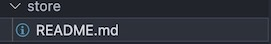

Store
===========

.. include:: ../style.rst

:green:`STORE`

In order to pass data from one component to another, props and events are used at certain places. However, the information relevant to clicked tab is shared among a number of components which may not be direct descendants of each other. Hence, Vuex store is used for state management, implementation done in store/index.js 
