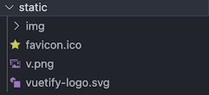

Static
===========

.. include:: ../style.rst

:green:`STATIC`

-  static folder is home for external javascript files containing zinc,
   dojo charts and models data.
-  img and videos folders are used to store images and videos, linked
   through markdown files stored in assets/data/markdown, respectively.
-  Reorganisation of content in this folder is recommended.
