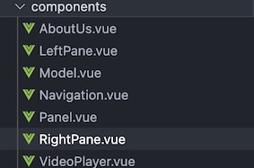

Components
===========

.. include:: ../style.rst

:green:`COMPONENTS`

-  navigation/LeftPane.vue is included in default layout, and depending
   upon the route, it displays either about/AboutUs.vue OR
   topics/Panel.vue components.

-  navigation/RightPane.vue is used in \_slug/index.vue page and
   facilitates displaying various features like heart rate, model and
   traces though their components i.e model/HeartRate.vue,
   model/Model.vue and model/Traces.vue respectively. It also displays
   topics/VideoPlayer.vue component, as layover when the video icon is
   clicked.
